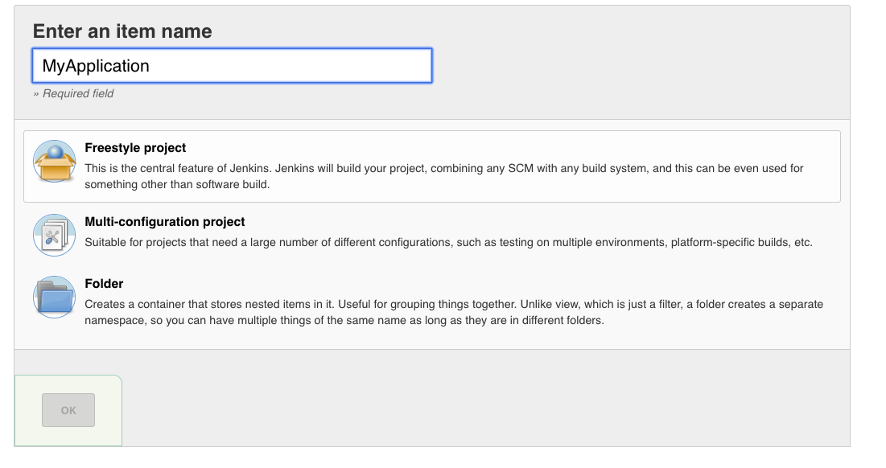
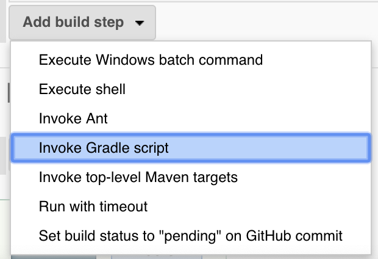

# Jenkins assemble apk

```
docker run -d -p 8080:8080 -p 50000:50000 --name MyJenkins \
-v [Home Directory]/jenkins_home:/var/jenkins_home a9911131/jenkins-android
```

## Build Jenkins

輸入以下指令下載Jenkins，並且啟動：

```text
$ docker run -d -p 8080:8080 -p 50000:50000 --name MyJenkins \
-v [Home Directory]/jenkins_home:/var/jenkins_home a9911131/jenkins-android
```

啟動後，就可以使用瀏覽器訪問[http://localhost:8080](http://localhost:8080)

## Create New Jobs

### Click New Item

click **New Item** on left menu, then ...



進入設定頁

### Source Code Management

選取Git，並且設定Repository URL及Credentials

### Build



#### Assemble signed apk

```text
clean
assembleRelease
-Pandroid.injected.signing.store.file=[keystore_path]
-Pandroid.injected.signing.store.password=[store_password]
-Pandroid.injected.signing.key.alias=[key_alias]
-Pandroid.injected.signing.key.password=[key_password]
```

Save

