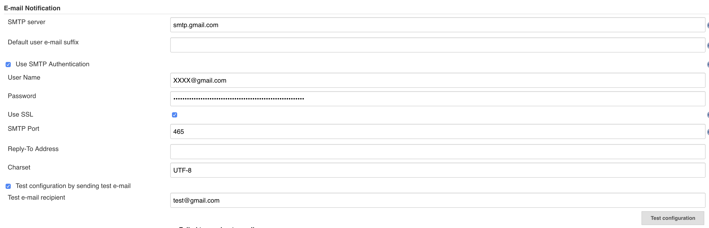
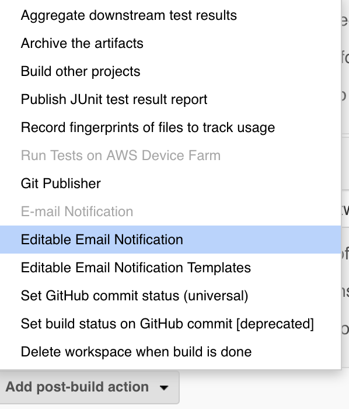
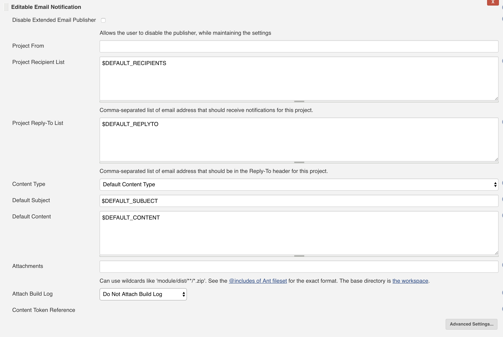
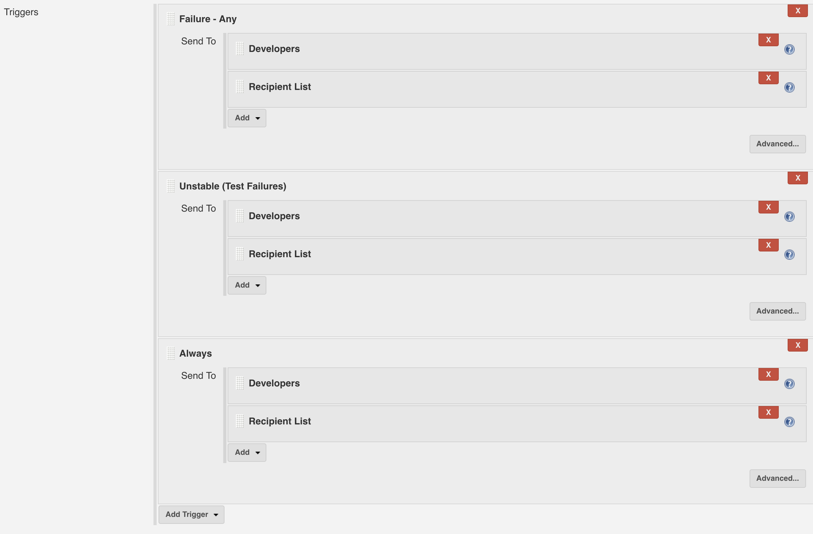

# Jenkins send email

## New docker Container

因為一開始建立container時只有開8080及5000 port，所以我們需要重新建立container來開25及465 port。如果不走ssl可以不用開465 port。

```text
docker stop MyJenkins
docker commit MyJenkins newjenkins
docker run -d -p 8080:8080 -p 50000:50000 -p 25:25 -p 465:465 --name MyJenkins2 \
-v [Home Directory]/jenkins_home:/var/jenkins_home newjenkins
```

## Setting

點選\[Manage Jenkins\] ，進入 \[Configure System\]

### E-mail Notification

如果不想建立SMTP server就指定google的吧！記得輸入gmail的帳密，並且將那個gmail設定為\[低安全性應用程式存取權設定\]。


可以點選\[Test configuration\]測試功能是否正常。




### Extended E-mail Notification

這個功能可以讓我們在 email 裡面使用環境變數等等功能自定內容，其餘設定與Email Notification雷同。

## Project Setting

點選進入專案的\[Configure\]，拉到最下面點選\[Add post-build action\] &gt; Editable Email Notification





### 設定預設內容

設定Default Content，內容參考如下

```text
項目名稱: $PROJECT_NAME<br/>

建置狀態: $BUILD_STATUS<br/>

建置編號: $BUILD_NUMBER<br/><hr/>

git Branch: ${GIT_BRANCH}<br/>

git版本號: ${GIT_REVISION}<br/>

git Log : ${CHANGES}<br/><hr/>

觸發原因: ${CAUSE}<br/><hr/>

建置位址: <a href="$BUILD_URL">$BUILD_URL</a><br/><hr/>

<table width="80%" border="0">
  <tr>
    <td align="center" colspan="3">自動測試報告彙整</td>
  </tr>
  <tr>
    <td align="center"><a href="${BUILD_URL}testReport">測試報告</a></td>
    <td align="center"><a href="${BUILD_URL}jacoco">測試覆蓋率</a></td>
    <td align="center"><a href="${BUILD_URL}androidLintResult">Android Lint</a></td>
  </tr>
</table>
<br/><hr/>

終端機輸出: <a href="${BUILD_URL}console">${BUILD_URL}console</a><br/><hr/>

變更集: ${JELLY_SCRIPT,template="html"}<br/><hr/>
```

### 設定觸發條件

預設只有失敗的時候寄給開發者

可點擊「Add Trigger」新增條件，如下圖我們設定觸發條件有

* Always
  * Developers \(這個應該是指 git 的 commiter\)
  * Recipient List \(收件人\)



