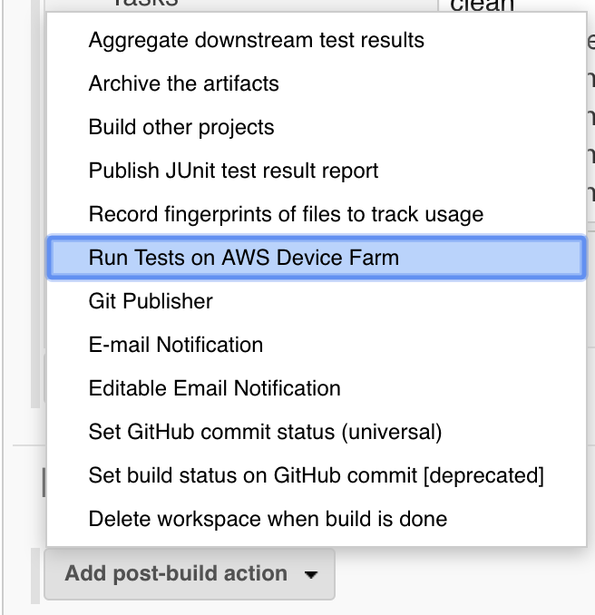
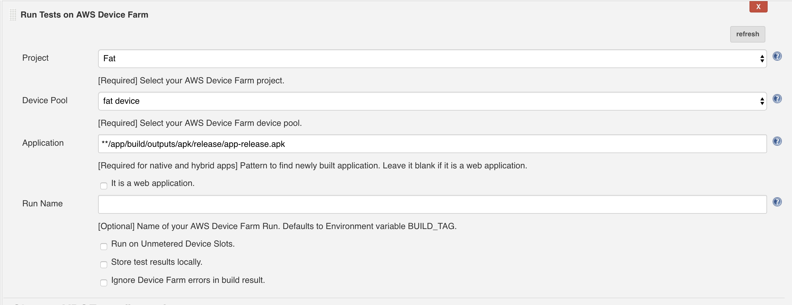
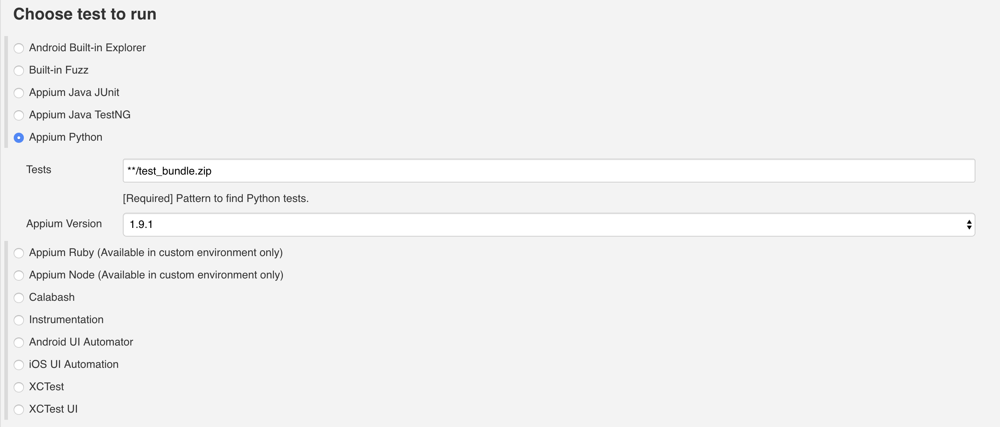
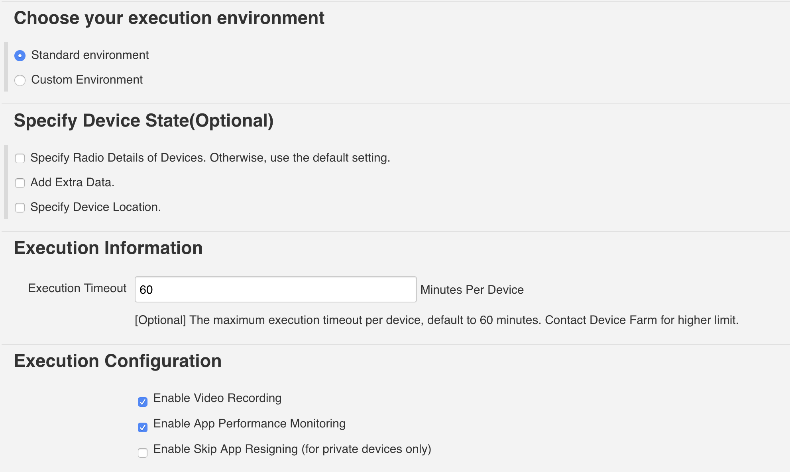

# Jenkins update test to AWS Device Farm

## Install Plugins&Setting Jenkins

參考[https://docs.aws.amazon.com/zh\_tw/devicefarm/latest/developerguide/continuous-integration-jenkins-plugin.html](https://docs.aws.amazon.com/zh_tw/devicefarm/latest/developerguide/continuous-integration-jenkins-plugin.html)

## Setting Jenkins Project

進入Project Configure

### 拉到Post-build Actions，點選Add post-build action

若專案目錄沒有做太多客製化設計的話，Application照以下設定就可以了

> \*\*/app/build/outputs/apk/release/app-release.apk

記得把測試檔也放在專案專案目錄裡

> \*\*/test\_bundle.zip

